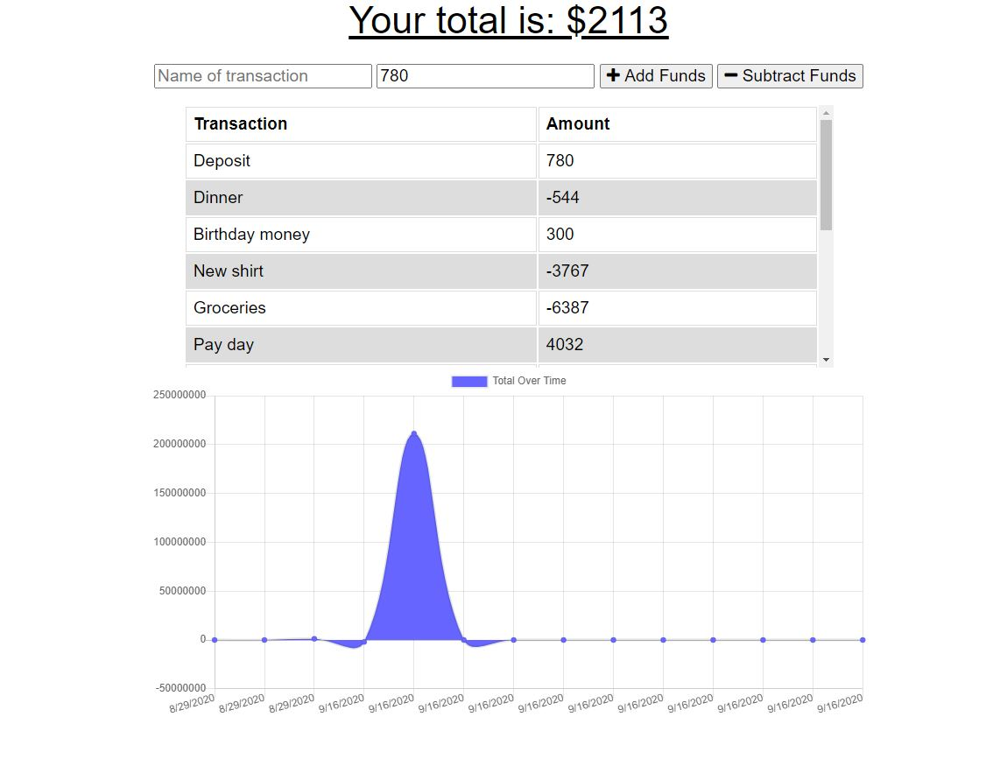

# Online/Offline Budget Tracker
## Description
  This application allows users to keep track of their budget while online or offline.
## Table of Contents
1.[Usage](#Usage)

2.[Contribution](#Contribution)

3.[Questions](#Questions)

Image of the application

## Installation Requirements
    npm i express
    npm i morgan
    npm i mongoose
    npm i compression
## Usage
    Users who want to keep track of their budget regardless of whether there is an internet connection or not.
## Badges
  
## Contribution
    Feel free to contact Ray's GitHub
## Heroku Deployed Link
   https://pure-escarpment-15667.herokuapp.com/
## Questions
    If you have any questions, please contact my GitHub: https://github.com/rnguyen7388
